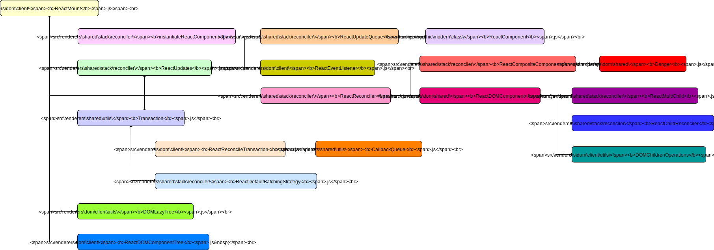

### 挂载和更新用到的文件

1. `src/renderers/shared/stack/reconciler/`

    1.  `ReactUpdates`
    2.  `instantiateReactComponent`
    3.  `ReactDefaultBatchingStrategy`
    4.  `ReactReconciler`
    5.  `ReactCompositeComponent`
    6.  `ReactMultiChild`
    7.  `ReactChildReconciler`
    8.  `ReactUpdateQueue`

2. `src/renderers/dom/client/`

    1.  `ReactMount`
    2.  `ReactReconcileTransaction`
    3.  `ReactDOMComponentTree`
    4.  `ReactEventListener`

3. `src/renderers/shared/utils/`

    1.  `Transaction`
    2.  `CallbackQueue`

4. `src/renderers/dom/client/utils/`

    1.  `DOMLazyTree`
    2.  `DOMChildrenOperations`

5. `src/renderers/dom/shared/`

    1. `ReactDOMComponent`
    2. `Danger`

6. `src/isomorphic/modern/class/`

    1. `ReactComponent`

### 各个文件的关系图

